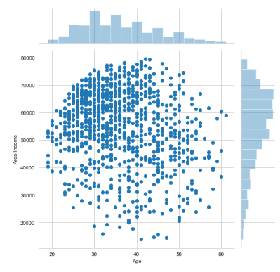
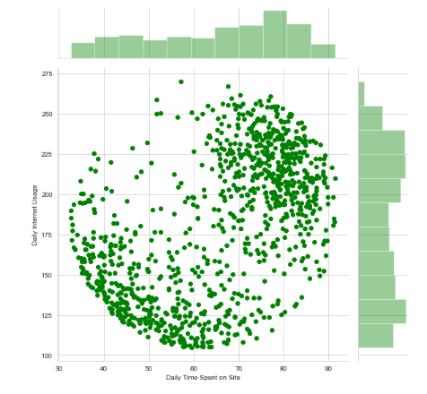
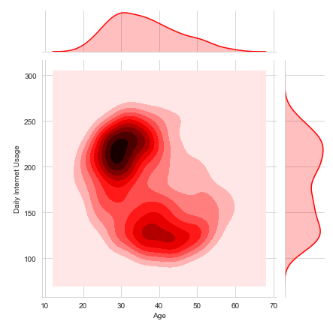
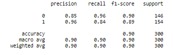
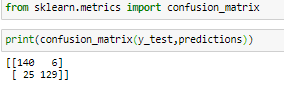

# Advertisement logistic Regression
This is a logistic regression problem where I have worked with a fake advertising data set, indicating whether or not a particular internet user clicked on an Advertisement. I have created a model that will predict whether or not they will click on an ad based off the features of that user.

Here I have read the data from a CSV file .
  
First of all I have done some data visualization with the help of "Matplotlib" and "Seaborn" to analyze the data visually.please find the images below,

  
I have used "Scikit Learn" libs to make the model,
  
  

And have used Scikit Learn libs to generate report matrices also,
  
  

  
Thank you for visiting.
